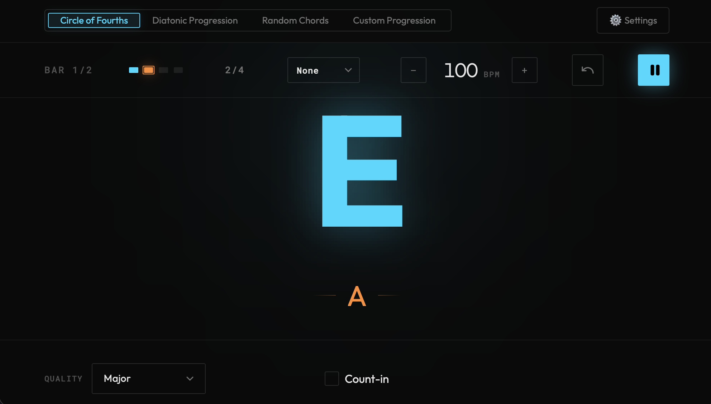
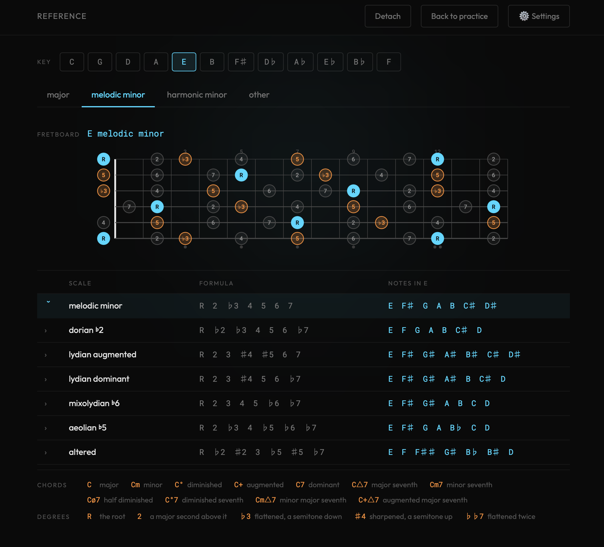

# 🎸 ChordFlow


ChordFlow is a desktop app designed to help guitarists/musicians
practice improvisation and master the guitar neck by providing dynamic chord progressions with a built-in metronome.  

Grab the latest [release](https://github.com/timvancann/chordflow/releases)



The scales reference: 27 scales in any of the twelve keys, with the fretboard for
whichever one you select. Roots are highlighted, and the thirds and fifths are
marked so you can see the chord sitting inside the scale.



## ✨ Features

- 🎵 SoundFont Audio – Woodblock metronome clicks and chord playback from a bundled SoundFont.
- 🔄 Practice Modes – Cycle the circle of fourths, walk a diatonic progression, or drill your own.
- 📊 Visual Progress Bar – Displays the current beat and bar progress.
- 🎼 Real-Time Chord Display – Shows the current and upcoming chord.
- 📖 Scales Reference – 27 scales across four families, spelled in any of the twelve keys, with the chords that fit each one.
- 🎸 Fretboard Diagrams – Every scale drawn across the neck in standard tuning, degree-labelled, with the thirds and fifths marked.
- 🔊 Playable Chords – Click any chord to hear it and see which scales it is a degree of.
- 🪟 Detachable Reference – Pull the reference page into its own window and park it on a second screen while you practise.

## 📦 Installation

1. Build from Source

```bash
git clone https://github.com/timvancann/chordflow
cd chordflow
cargo build --release
```

2. Grab the latest [release](https://github.com/timvancann/chordflow/releases)

### Opening the app on macOS

Releases are ad-hoc signed and not notarized by Apple, so the first launch is blocked by
Gatekeeper with a message like "ChordFlow is damaged and can't be opened". The app is fine,
macOS just refuses unnotarized downloads. After installing, remove the quarantine flag once:

```bash
xattr -d com.apple.quarantine /Applications/ChordFlow.app
```

After that the app opens normally.

## 🚀 Usage

Install [Dioxus CLI](https://dioxuslabs.com/learn/0.7/getting_started/), then:

```bash
just run
```

Note that Deno also ships a binary called `dx`, which can shadow the Dioxus CLI
on your PATH. The `just` recipes call `~/.cargo/bin/dx` explicitly to avoid that;
set `DX=/path/to/dx` if yours lives somewhere else.

## 🏗️ Roadmap

- [ ] Fix Linux release
- [x] Add more scales (e.g. melodic minor)
- [x] Better feedback and UI on custom progressions
- [ ] Allow dynamically update the number of beats per bar
- [x] Use [Dioxux](https://dioxuslabs.com/) to create a GUI native app

## 🤝 Contributing

Contributions are welcome! Feel free to submit issues and pull requests.

1. Fork the repo
2. Create a new branch (git checkout -b feature-name)
3. Commit changes (git commit -m "Added cool feature")
4. Push to branch (git push origin feature-name)
5. Open a pull request

### Pre-commit hook

The repo ships a hook that blocks a commit unless `cargo fmt --all --check` and
`cargo clippy --workspace --all-targets -- -D warnings` both pass. Git does not
enable hooks from a clone automatically, so turn it on once per checkout:

```bash
git config core.hooksPath .githooks
```

Bypass it for a single commit with `git commit --no-verify`.

Some tables are deliberately kept wider than rustfmt would like, because they
are meant to be read against a reference document rather than reflowed. The
scale formulas in `chordflow_music_theory/src/scale.rs` are the precedent: they
carry `#[rustfmt::skip]` with a comment saying why. Prefer that over reflowing
a table you are meant to be able to eyeball.
